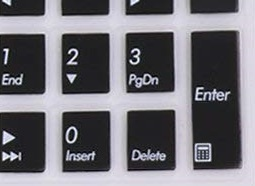

# ATKMediaInterceptor
## About
If you are running **ASUS ATK Package**, this allows **ASUS Media keys** to **work with other media players** than Windows Media Player and Windows Media Center.

By default it:
- Forwards ASUS specific media keys (playPause/next/prev/stop) to system recognizable media keys.  
  - (eg. When you go to modify hotkeys in say foobar2000, it will be able to detect and understand the key press.  Note: You **don't** actually need to configure foobar2000 after this fix, foobar is already smart enough.)
- Enables the generic ASUS button to open foobar2000.exe (customizable)
- Enables the calculator button to open the calculator (customizable)

[Tested on](../../wiki/Tested-on)

## How to Use

Download [ATKMediaInterceptor.conf](https://github.com/Lindsay-Needs-Sleep/ATKMediaInterceptor/releases/download/v1.0/ATKMediaInterceptor.conf)  
Download [DMedia.exe](https://github.com/Lindsay-Needs-Sleep/ATKMediaInterceptor/releases/download/v1.0/DMedia.exe)

Modify ***ATKMediaInterceptor.conf*** as desired, [about config](#atkmediainterceptorconf).  

In `C:\Program Files (x86)\ASUS\ATK Package\ATK Media\`  
rename ***DMEdia.exe*** to ***DMedia.exe.old*** or something if (incase you want to use it again)  
Copy the downloaded files to `C:\Program Files (x86)\ASUS\ATK Package\ATK Media\`  
Run the new ***DMedia.exe***    

## ATKMediaInterceptor.conf

### generic_button_command
*value:* Accepts a [command](#command-can-be).  
*Trigger:* Generic button press.  Not all laptops have this button.  (Also possibly known as quick launch button and multimedia button.)

  

### calculator_button_command
*value:* Accepts a [command](#command-can-be).  
*Trigger:* Calculator button press.  Not all laptops have this button.  (Usually in the num pad.)

  

#### Command can be
- The path to a program to open
  - `C:\Program Files (x86)\foobar2000\foobar2000.exe`
- A command
  - `echo hiyo!`
- A batch file to run 
  - `cmd.exe /c "C:\myBatchFile.bat"`
